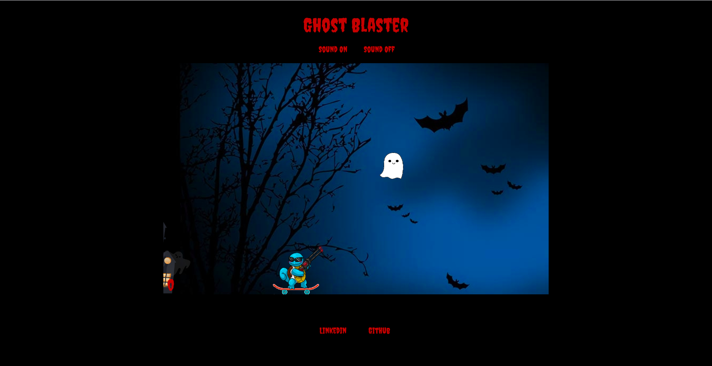
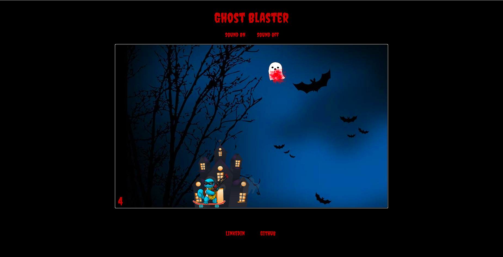

# GhostBlaster

Ghost Blaster is an endless shooting game. Ghosts float across the screen, and the player tries to shoot as many ghosts as possible without letting any ghosts reach the end of the screen. 

## Technologies
Ghost Blaster was made using: 
1. HTML Canvas
2. CSS3
3. Javascript

## Game Play

Upon visiting the game site, a player sees the shooter in his starting position, and instructions on how to play the game. 


When the player presses any button, the game starts and ghosts begin generating on the screen.



## Shooting

To kill ghosts, the player should click on a ghost and that click will fire a bullet with a slope based on the x and y coordinates of the click event.

```
    shoot(e) {
        if (this.running) {

            if (this.bullets.length > 15) {
                this.bullets.shift();
            }
            
            const bullet = new Bullet();
            this.bullets.push(bullet);
    
     
            const x = e.clientX - this.canvas.offsetLeft;
            const y = e.clientY - this.canvas.offsetTop;
            bullet.moveBullet(x, y); 
        }
    }

        moveBullet(x, y) {

            if (x) {
                this.speed[0] = (x - this.position[0]);
                this.speed[1] = (y - this.position[1]);
            } else {
                this.position[0] += (this.speed[0] / 20);
                this.position[1] += (this.speed[1] / 20);
            }

    }
```

## Shot Ghosts

When shot, ghosts will change in appearance and linger for a moment before disappearing from the screen.



This was done by clearing the coordinates of the shot ghost, replacing the image on those coordinates, and then filtering dead ghosts out of the array that stores the ghosts so that dead ghosts are cleared from the canvas.

```
    hitGhost(ctx) {

        this.ghosts.forEach((ghost, i) => {
            if (this.collidesWith(ghost)) {
                this.score += 1;
                ghost.velocity = 0;
                this.score += 1;
                ghost.dead = true;
                setTimeout(() => this.ghosts = this.ghosts.filter(ghost => !ghost.dead), 1000)
            }
        })
    }

    // ghosts are animated differently depending on their dead status

        newGhost(ctx) {

        var unshotGhost = new Image();
        unshotGhost.src = './images/unshot_ghost.png';
        ctx.drawImage(unshotGhost, this.x, this.y, 63, 70)

        let that = this;
        unshotGhost.onload = function() {

            ctx.drawImage(unshotGhost, that.x, that.y, 63, 70)
        }

        if (this.dead) {
            ctx.clearRect(this.x, this.y, 63, 70);
            this.shotGhost(ctx);
            this.deadGhost(ctx);
        }
    }


```


